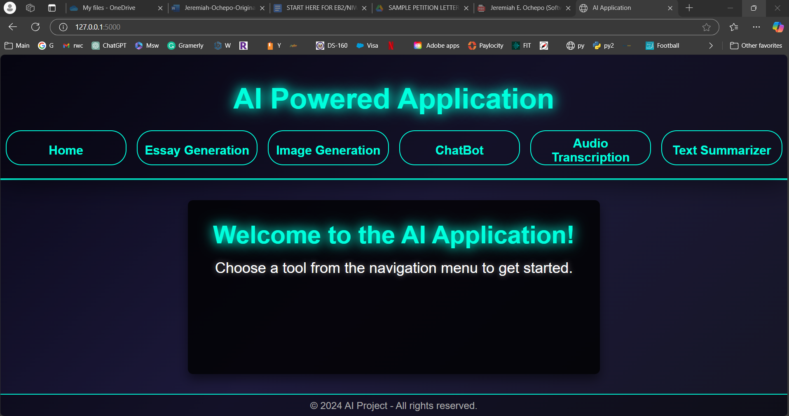
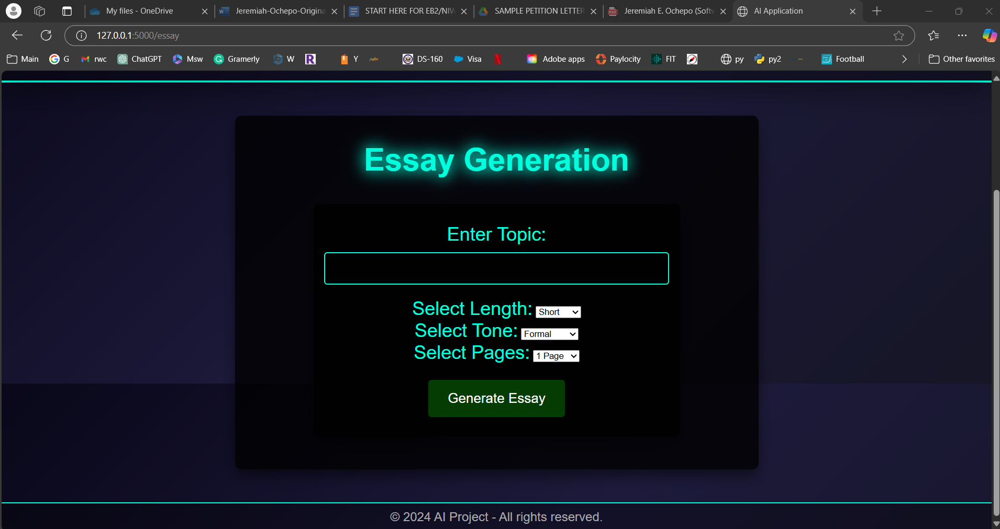
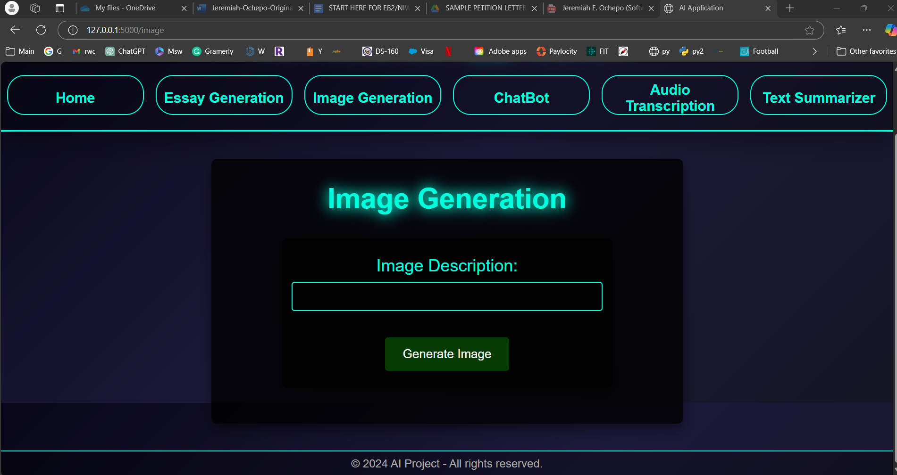
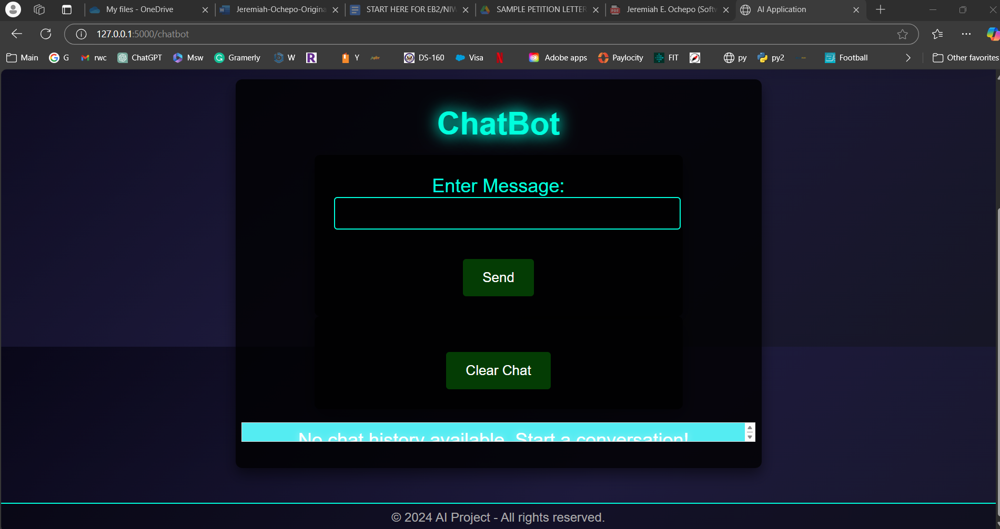
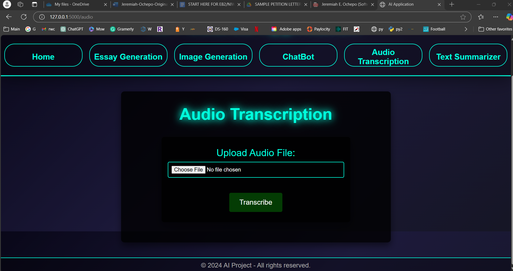
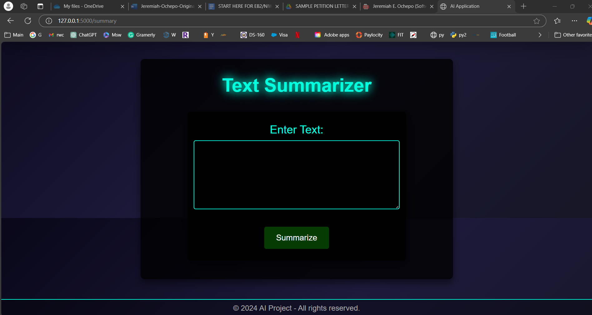

# AI-Powered Multi-Tool Web Application



## Overview
This is a Flask-based web application integrating OpenAI's GPT-3.5 and DALL-E APIs, providing a comprehensive suite of AI-powered functionalities. The project showcases innovative implementations of AI in text generation, image creation, conversational AI, audio transcription, and text summarization. This proof-of-concept aims to demonstrate how AI can tackle real-world challenges with user-friendly tools.

---

## Features

### 1. **Essay Generator**  
  
- Generate essays based on user-provided topics, tones, and lengths.
- Save essays as downloadable `.docx` files.
- Ideal for students, writers, and professionals.

### 2. **Image Generator**  
  
- Create AI-generated images from descriptive text inputs using DALL-E.
- Save and download generated images.
- Perfect for design, visualization, and creative tasks.

### 3. **Chatbot**  
  
- Real-time conversational AI powered by GPT-3.5.
- Maintains session-based chat history for continuity.
- Useful for customer support, education, or casual interaction.

### 4. **Audio Transcription**  
  
- Transcribe audio files to text using OpenAI's Whisper API.
- Save transcriptions as text files for download.
- Great for accessibility, meeting notes, and content documentation.

### 5. **Text Summarizer**  
  
- Condense lengthy text into concise, digestible summaries.
- Ideal for processing research, articles, or long reports.

---

## Technologies Used

### **Backend**:
- Flask (Python)

### **Frontend**:
- HTML and CSS (with Jinja templates for dynamic rendering)

### **AI Models**:
- OpenAI's GPT-3.5 for text and chatbot features.
- DALL-E for image generation.
- Whisper for audio transcription.

### **Key Libraries**:
- `requests` for API interactions.
- `docx` for generating Word documents.
- `secure_filename` for safe file uploads.

---

## Use Cases and Impact
This project highlights how AI tools can:
- Enhance productivity through automation.
- Foster creativity with innovative features like image generation.
- Improve accessibility with functionalities like audio transcription.
- Empower individuals and businesses with scalable solutions.

---

## Setup Instructions

### 1. Clone the Repository
```bash
git clone https://github.com/yourusername/ai-powered-multi-tool.git
cd ai-powered-multi-tool
```

### 2. Install Dependencies
```bash
pip install -r requirements.txt
```

### 3. Set Up OpenAI API Key
- Create a `config.py` file and add your OpenAI API key:
```python
API_KEY = 'your_openai_api_key'
```

### 4. Run the Application
```bash
python app.py
```

### 5. Access the Application
- Open your browser and navigate to `http://127.0.0.1:5000`.

---

## Future Improvements
- Implement user authentication and role-based access control.
- Add database integration for user data and generated content storage.
- Expand AI functionalities to include real-time translation and voice-to-text features.

---

## Screenshots

### Home Page


### Essay Generator


### Image Generator


### Chatbot


### Audio Transcription


### Text Summarizer


---

## License
This project is open-source and licensed under the [MIT License](LICENSE).

--- 
